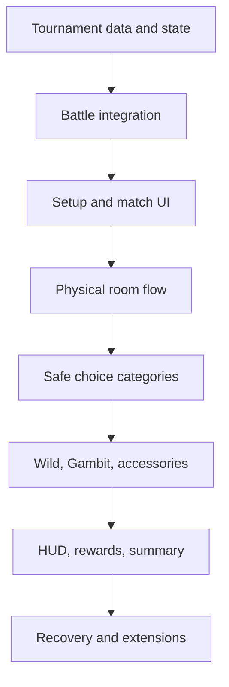

# Tournament Implementation Phases

I would use eight phases. Each phase should receive its own detailed discussion and implementation plan only when we reach it. Planning all eight technically now would produce assumptions that earlier phases will probably invalidate.

## Phase 1 — Tournament data and run state

Build the system’s non-visual foundation:

- tournament JSON definitions and loader;
- validation for opponents, arenas, categories, rewards, and node order;
- `TournamentRun` player state;
- six figure snapshots;
- variable accessory-slot snapshots;
- figure HP ledger;
- accessory states;
- current node and explicit run phase;
- pending next-battle effects;
- serialization between matches;
- debug commands to create, inspect, advance, reset, and end a run.

The run should use explicit states such as:

- setup;
- waiting at match;
- selecting team;
- in battle;
- waiting at choice;
- completed;
- failed.

This prevents the implementation from becoming a collection of loosely related booleans.

Success condition: a test tournament can be loaded and advanced through fake nodes using commands, with its complete state surviving a world save.

## Phase 2 — General battle integration, XP, and reports

This is the most architecturally important phase.

Create a general way to start a battle with a supplied battle context instead of always reading the Titan Manager’s three active slots. The tournament passes:

- one to three selected figure snapshots;
- their tournament HP;
- team order and opening figure;
- combo selection;
- selected tournament accessory;
- opponent team;
- arena;
- XP reward;
- tournament/run identifiers.

The battle then returns a structured result containing:

- victory or defeat;
- normalized remaining figure HP;
- faints and defeated opponents;
- participated figure slots;
- XP awarded;
- general battle statistics.

This phase should also implement the general reduced bench-XP rule and begin collecting reusable `BattleReport` statistics. The report display can wait; collection should start here.

Success condition: a command can start a tournament-style battle using arbitrary figures, preserve their supplied HP, return updated HP, award full/reduced XP correctly, and report victory or defeat without using Titan Manager active slots.

## Phase 3 — Setup and pre-match interfaces

Now implement the detailed selection flow:

- tournament setup with exactly six figures;
- variable accessory slots;
- Titan Manager figure and accessory projections;
- duplicate-accessory validation;
- zero-accessory tournaments;
- tournament snapshot confirmation;
- pre-match selection of one to three living figures;
- team order, opening figure, and combo;
- available accessory or no accessory;
- default opponent preview;
- hidden-team match option;
- pending next-battle benefit/penalty display.

Use a temporary command or test block to open these screens. The physical room is not needed yet.

Success condition: the player can complete a short multi-match tournament through screens/debug entry, with HP and accessory use persisting correctly.

This is the first genuinely playable vertical slice and should be tested extensively before building rooms or choice effects.

## Phase 4 — Physical tournament room and NPC progression

Once the run logic works, give it the real presentation:

- tournament room structure loading;
- instanced room slots;
- authored player return/checkpoint positions;
- opponent NPC placement;
- names and portraits;
- dialogue interaction;
- invisible barrier coordinates;
- NPC moving aside after victory;
- returning from arena battles to the correct corridor position;
- physical visibility of future NPCs and paths;
- boss area and completion area;
- room cleanup after success or failure.

The structure system should distinguish:

- visual room geometry;
- authored runtime markers or coordinates;
- tournament node data.

Success condition: the player can physically walk through a basic tournament containing normal opponents and a boss, while the existing tournament logic controls every barrier and return point.

## Phase 5 — Choice framework and safe categories

Build the generic physical choice system first, then implement the simpler categories:

- two visible category paths;
- shared hidden node strength;
- committing to one route;
- permanently closing the other;
- result rolling and reveal animation;
- target-selection UI;
- eligibility filtering;
- pending effect application.

First categories:

1. Recovery
2. Revive
3. Preparation

These validate nearly everything the general choice engine needs:

- immediate roster-state modification;
- targeted multi-charge interaction;
- weighted fallback coins;
- next-battle resources;
- next-battle effects;
- hidden strength scaling.

Success condition: a physical choice fork can resolve all three categories correctly, update the HUD/state, and apply Preparation effects to the next battle.

## Phase 6 — Accessory, Wild, and Gambit

Implement the more stateful and random categories after the generic framework is proven.

Accessory:

- Restore;
- Preserve;
- Replacement;
- spent/preserved/lost transitions;
- Titan Manager replacement selection;
- duplicate validation.

Wild:

- equal top-level outcome selection;
- nested healing charge roll;
- randomized magnitude;
- full-value healing eligibility;
- completion-reward-based coin calculation.

Gambit:

- permanent visible 50/50;
- eligible positive/negative pools;
- enhanced good outcomes;
- player choice between valid Accessory actions;
- intelligent filtering;
- damage clamp at 1 HP;
- permanent accessory loss;
- completion-reward-based coin percentage.

Success condition: every category handles zero-accessory tournaments, invalid outcomes, low-HP rosters, no-faint rosters, and exhausted accessories without producing impossible or worthless results.

## Phase 7 — HUD, rewards, and final summary

Complete the intended player-facing loop:

- six-figure corridor HUD;
- HP and fainted presentation;
- accessory availability/preservation/spent/lost states;
- pending benefit and penalty icons;
- tournament progress;
- final boss reward reveal;
- hidden figure and coin reward;
- identical repeat-clear rewards;
- duplicate-safe reward granting;
- aggregated final summary;
- completion exit.

The general battle reports collected since Phase 2 now feed:

- damage dealt/taken;
- healing;
- duration;
- faints;
- defeated figures;
- tofu used;
- XP;
- accessory activity.

Success condition: completing or losing a tournament produces the correct polished conclusion, and repeating it grants the exact same reward without accidental duplicate claims from reopening the screen.

## Phase 8 — Robustness and later extensions

Only after the core experience works:

- give-up item in the last hotbar slot;
- cleanup confirmation;
- disconnect/reconnect handling;
- mid-battle recovery checkpoints;
- server restart behavior;
- multiplayer room-slot hardening;
- normal-battle result screens using `BattleReport`;
- tournament wagers;
- wager rewards;
- broader story/unlock integration.

Wagers should probably become their own subproject within this phase because their conditions and reward valuation deserve another design discussion.

## Why This Order

The dependency chain is:

The most important decision is implementing the full multi-match logic before the physical room. Otherwise room interactions, NPCs, barriers, and UI could become tightly coupled to unfinished tournament state.

I would therefore start by discussing Phase 1 in detail and creating a focused implementation plan for only that phase. Once it is implemented and tested, we use the actual resulting code to design Phase 2 rather than predicting its architecture now.
